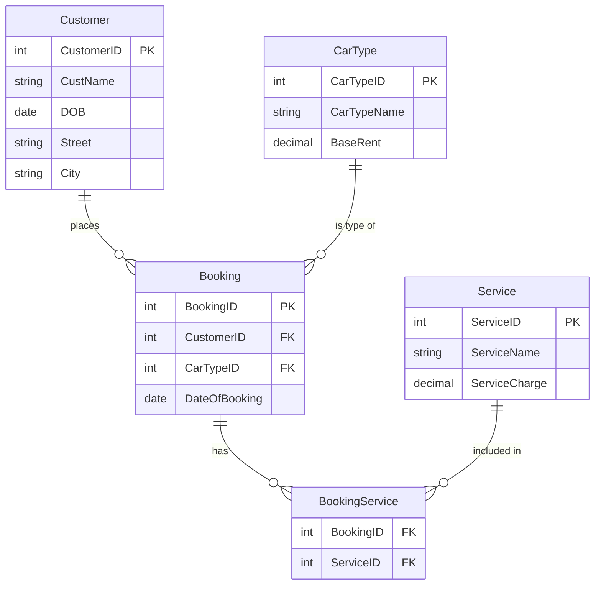

# 🚗 CarRentalSystem — BOOKING.COMpiler_OS

> A car rental booking system made in **Java**. It uses a **MySQL** database in the cloud and runs online.

<p align="left">
  
  
  
  
  
</p>

---

## 📖 About

**CarRentalSystem** is a console program. It works in the terminal. With this program you can manage clients, bookings, and money reports. All the data is saved in a live MySQL database on **Aiven** (a cloud company).

I made this project for my Computer Science course at **CCT College Dublin**. I worked hard on clean code, safe passwords, and real cloud deployment.

> 💡 **Tip:** The program uses colours, clears the screen, and has other visual effects. For the best experience, run it in a real terminal (macOS Terminal, PowerShell, or Command Prompt), not inside an IDE. Some IDE terminals cannot show these effects.

---

## 🌐 Live Demo

▶️ **[Try it on Replit](https://car-rental-system--johanndrums.replit.app)**

You can use the program directly in your browser. You do not need to install anything.

---

## ✨ Features

- **👤 Client Management** — add, see, and change customers.
- **📅 Booking Management** — add, see, and delete bookings.
- **💰 Financial Report** — see the total money from all bookings.
- **✅ Input Validation** — the program checks your data, so you cannot save wrong information.
- **🎨 Nice Interface** — colours, blinking text, sounds, and a clean screen.
- **🛡️ Safe Error Messages** — the program shows simple messages instead of long, scary errors.

---

## 🛠️ Technologies

| Part             | Technology                                  |
|------------------|---------------------------------------------|
| Language         | Java (JDK 8 or higher)                      |
| Database         | MySQL 8 (in the cloud, on Aiven)            |
| Connector        | MySQL Connector/J 8.0.31                    |
| Build Tool       | Apache Ant (NetBeans project)               |
| Deployment       | Replit                                      |
| Version Control  | Git and GitHub                              |

---

## 🏗️ Project Structure

```
src/
├── main/         # The start of the program (Main.java)
├── menus/        # The main menu and the sub-menus
├── managers/     # The logic for bookings, clients, and money
├── SQLs/         # Database actions (Insert, Select, Update, Delete)
├── Database/     # The database connection (DataBaseConnection.java)
├── validation/   # Classes that check the user's data
└── Utilities/    # Colours, sounds, screen clearing, and dates
```

### Important Ideas
- **One connection (Singleton pattern).** The program opens only one connection to the database and uses it again and again. This saves memory.
- **Clean organisation.** Each part of the code has its own folder: menus, logic, SQL, and validation. This makes the code easy to read.
- **Safe password.** The password is not written in the code. The program reads it when it starts.

---

## 🗄️ Database Schema

The database is well organised (normalised to 3NF). It has five tables. The table `BookingService` connects bookings and services, because one booking can have many services.



### The Tables

| Table              | What it stores                                       | Main Columns                                  |
|--------------------|------------------------------------------------------|-----------------------------------------------|
| **Customer**       | The client's personal details.                       | `CustomerID` (PK), `CustName`, `DOB`, `Street`, `City` |
| **CarType**        | The car types and their base price.                  | `CarTypeID` (PK), `CarTypeName`, `BaseRent`   |
| **Service**        | Extra services you can add to a booking.             | `ServiceID` (PK), `ServiceName`, `ServiceCharge` |
| **Booking**        | One rental for one customer and one car.             | `BookingID` (PK), `CustomerID` (FK), `CarTypeID` (FK), `DateOfBooking` |
| **BookingService** | Connects a booking to its services.                  | `BookingID` (FK), `ServiceID` (FK)            |

### The Relationships
- One **Customer** can have many **Bookings**.
- One **CarType** can be in many **Bookings**.
- One **Booking** can have many **Services**, and one **Service** can be in many **Bookings**. The table **BookingService** makes this connection.

> 💰 The program does not save the total price. It calculates the total when you need it (`BaseRent + ServiceCharge`), using a JOIN of the tables. This keeps the data clean.

---

## 🚀 How to Run

### Before you start
- Java JDK 8 or higher
- Access to the MySQL database (or your own MySQL)

### 1. Copy the project to your computer
```bash
git clone https://github.com/johannbeckerr/CarRentalSystem.git
cd CarRentalSystem
```

### 2. Run the program
The password is safe. It is not in the code. You give it when you run the program:

```bash
java -DDB_PASSWORD=your_password_here \
     -cp "build/classes:mysql-connector-j-8.0.31.jar" \
     main.Main
```

> On Windows, use `;` instead of `:` in the classpath.

---

## 🔐 Security

This project keeps the password safe:
- The program reads the password from `DB_PASSWORD` when it starts. The password is not in the code.
- The `.gitignore` file keeps the secret NetBeans file out of Git.
- I cleaned the repository, so there are no passwords in the history.

---

## 👨‍💻 Author

**Johann Becker**
Computer Science Student @ CCT College Dublin
🔗 GitHub: [@johannbeckerr](https://github.com/johannbeckerr)

---

⭐ If you like this project, please give it a star!
